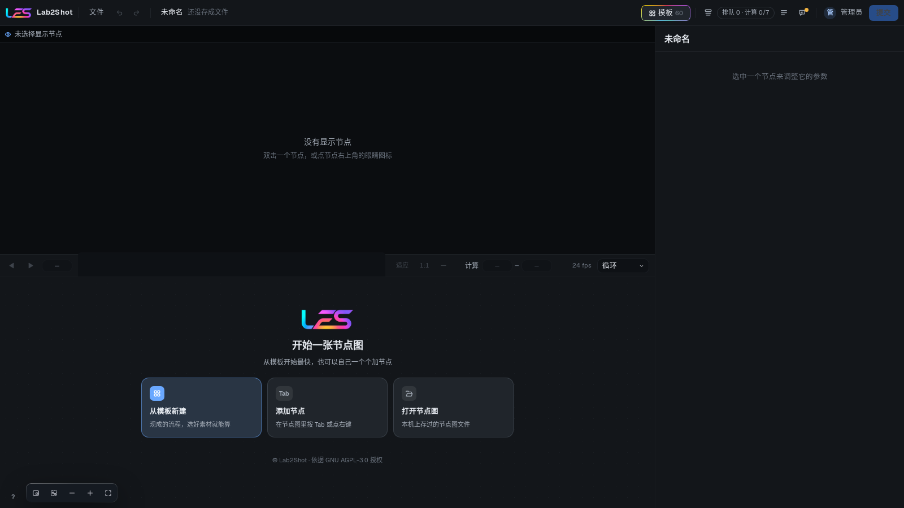

# Lab2Shot

<p align="center"></p>

Lab2Shot brings machine-learning research into computer-graphics production. It packages published research code — camera solving, matting, body and face capture, lighting estimation and related methods — as nodes that film and game artists can use directly. All results are delivered in standard formats: USD for 3D data (Y-up, centimetres) and EXR / PNG / JPG for images, colour-managed with OCIO, ready for import into Houdini and Maya.

Lab2Shot 将机器学习研究成果引入计算机图形制作流程。项目把已发表的研究代码（相机解算、抠像、人体与面部捕捉、光照估计等）封装为节点，供影视与游戏美术人员直接使用。全部结果以标准格式交付：三维数据为 USD（Y 轴向上，单位厘米），图像为 EXR / PNG / JPG，色彩由 OCIO 管理，可直接导入 Houdini 与 Maya。

## 功能

Lab2Shot 以兼容层的形式接入第三方研究项目，并按制作任务将其组织为以下类别：

- 镜头解算
- 三维重建
- 深度与法线
- 抠像与遮罩
- 跟踪
- 光流与对位
- 人体动捕
- 动作编辑
- 面部
- 光照与材质
- 格式与交付

各兼容层的节点、输入输出、显存需求与许可证说明位于 `adapters/<项目名>/docs.md`。

## 安装

### 系统要求

- Linux，或 Windows 下的 WSL2。
- NVIDIA 显卡及驱动（用于显卡计算任务；无显卡时服务仍可启动）。
- Python 3.13，由 [uv](https://docs.astral.sh/uv/) 自动安装，无需系统预装。
- Node.js 20.19 及以上（20.x）或 22.12 及以上，用于构建网页界面。

### 配置步骤

在仓库根目录执行：

```bash
./setup.sh
```

`setup.sh` 提供一个分组的配置菜单，仅执行所选的项目；每一项执行之前均说明其操作、用途、写入位置与影响范围。若系统中尚未安装 uv，脚本将首先引导安装。菜单顶部显示 Lab2Shot 版本、服务是否运行及其地址、管理员是否已设置密码以及工作目录。顶层菜单如下：

| 编号 | 分组 | 说明 |
|---|---|---|
| 1 | 首次安装向导 | 依次引导完成 Python 环境、构建网页、检查环境、启动服务、设置管理员密码与显卡授权；每一步开始前说明其内容并询问是否执行，均可跳过。 |
| 2 | 安装与环境 | Python 环境、构建网页、检查环境、内核配置。 |
| 3 | 账号与安全 | 管理员密码、找回口令。 |
| 4 | 服务 | 启动（后台或前台）、重启、停止服务，以及显卡授权。 |
| 5 | 设置 | 管理后台「设置」页的全部设置项，按相同分组列出当前值、默认值及是否需重启生效，并可逐项修改。 |
| 6 | 数据库 | 状态、立即备份、完整性检查、从备份恢复、升级、接管工作目录。 |
| 7 | 状态总览 | 服务、管理员密码、找回口令、账号数、扩展包数、数据库与工作目录的概况。 |
| 0 | 退出 | 退出菜单。在各分组的二级菜单中，0 表示返回上一级。 |

各分组包含的项目及对应的步骤名如下：

| 分组 | 项目 | 步骤名 | 说明 |
|---|---|---|---|
| 首次安装向导 | 首次安装向导 | `wizard` | 按顺序执行 `env`、`web`、`check`、`start`、`password`、`gpus` 六个步骤，结束时汇总各步骤的结果。 |
| 安装与环境 | Python 环境 | `env` | 执行 `uv sync`，依据 `uv.lock` 创建服务与命令行所需的环境（`.venv/`）。 |
| | 构建网页 | `web` | 执行 `npm install` 与 `npm run build`，生成网页界面（`webui/dist/`）。 |
| | 检查环境 | `check` | 列出 Python、uv、Node.js、网页构建、显卡驱动、工作目录与设置文件的状态，不做任何修改。 |
| | 内核配置 | `kernel` | 编译环境设置、工具链检查、下载镜像、重试策略，以及场景格式模块（Alembic、FBX）的安装。 |
| | Hugging Face 登录 | `hf-login` | 列出须申请访问的模型及其申请页面，并在本机登录 Hugging Face。 |
| | 手动下载 | `downloads` | 识别并安装 `downloads/` 中的文件，列出每一项须自行下载的文件的下载页面、所需文件与状态。 |
| 账号与安全 | 管理员密码 | `password` | 设置或重设管理员账号的密码。 |
| | 找回口令 | `passphrase` | 设置用于找回管理员密码的口令（登录页「忘记密码」凭此口令重设密码）。 |
| 服务 | 启动服务（后台） | `start` | 在后台启动服务，日志位于 `work/logs/`。 |
| | 启动服务（前台） | `start-fg` | 在当前终端运行服务，用于查看日志。 |
| | 重启服务 | `restart` | 重启运行中的服务，可等待当前任务完成后进行。 |
| | 停止服务 | `stop` | 停止监听端口的服务进程。 |
| | 显卡授权 | `gpus` | 指定接受计算任务的显卡。 |
| 设置 | 设置 | `settings` | 按人员、队列与显存、内存、存储与清理、网络、视图、安装、环境分组修改设置，写入 `config/local.toml`，校验规则与管理后台相同。离开该分组时，列出需重启服务才生效的改动，并询问是否立即重启。只能在配置文件中修改的项（工作文件夹）以及账号、配额等管理功能，请在配置文件或管理后台中处理。 |
| | 服务器设置 | `server` | 依次设置监听范围、端口、HTTPS 与对外域名（与「设置 → 网络」相同）；局域网访问需监听 0.0.0.0。 |
| 数据库 | 状态 | `db-status` | 显示数据库文件、大小、版本、完整性检查结果，并列出全部备份。 |
| | 立即备份 | `db-backup` | 立即备份一份数据库；服务运行时亦可执行。 |
| | 完整性检查 | `db-check` | 执行 SQLite 完整性检查与外键检查。 |
| | 从备份恢复 | `db-restore` | 列出全部备份（编号、时间、大小、来由），以所选备份替换当前数据库。执行前须停止服务（菜单提供停止服务的选项），并经两次确认；当前数据库移至 `work/db/lab2shot.db.replaced-<时间>`，不会删除。恢复后须重新启动服务。 |
| | 升级 | `db-upgrade` | 先自动备份，再将数据库升级至当前程序对应的版本；须先停止服务。启动服务时也会自动执行此步骤。 |
| | 接管工作目录 | `db-claim` | 使工作目录归属当前项目目录；此后其他项目目录的进程无法打开该工作目录。 |
| 状态总览 | 状态总览 | `status` | 显示当前状况的概览，不做任何修改。 |

首次安装请执行第 1 项「首次安装向导」，或依次执行 `env`、`web`、`check`、`start`。**服务首次启动后，请执行「账号与安全 → 管理员密码」，为管理员账号 `admin` 设置密码；在设置密码之前，任何人都无法登录。** 新安装的服务默认不使用任何显卡，请在「服务 → 显卡授权」中列出本机识别到的显卡并选择接受计算任务的显卡；首次安装向导的最后一步即为此项。

也可单独执行某一项而不进入菜单：`./setup.sh <步骤名>`（环境就绪后亦可使用 `uv run lab2shot setup <步骤名>`），步骤名见上表。只读的项目（如 `check`、`status`、`db-status`）不会创建工作目录、数据库或本机令牌。在任何提示处按 Ctrl-C，均返回上一级菜单。

服务默认地址为 http://localhost:8765 。

### 扩展包与模型下载

各算法以扩展包的形式安装：在管理后台「扩展包」页点击「安装」，或执行 `uv run lab2shot ext install <项目名>`。安装器自动获取代码、建立独立环境并下载绝大多数模型权重，无需手动操作。

**少数模型须自行下载，或须先在其模型仓库申请访问。需要哪些文件、下载页面、下载哪一项以及文件放在何处，完整列于 [docs/manual-downloads.md](docs/manual-downloads.md)。** 概要如下：

1. **须自行下载的文件**：按文档中的下载页面下载所列文件，原样放入 Lab2Shot 目录下的 `downloads/` 文件夹（无需解压或改名），再执行 `./setup.sh downloads`，即自动识别并安装。
2. **须申请访问的模型**：按文档在对应页面申请访问，获批后执行 `./setup.sh hf-login` 登录，再安装相应的扩展包。

两类文件的当前状态可随时在 `./setup.sh` 的「安装与环境」菜单中查看。仅在使用相应扩展包时才需要这些文件。

## 使用

1. 在浏览器中打开服务地址，以 `admin` 或管理员创建的账号登录。
2. 在模板面板中按类别选择模板，据此新建节点图。
3. 指定输入素材（图像序列或视频）与结果保存位置，并按需调整模板公开的参数。
4. 提交任务。任务进入队列，由已授权的显卡计算。
5. 获取结果：USD 与 EXR / PNG / JPG 文件写入指定位置，可直接导入 Houdini 或 Maya。

模板所用的研究项目需先安装对应的扩展包。可在管理后台的「扩展包」页面安装，或使用命令行：

```bash
uv run lab2shot ext list
uv run lab2shot ext install <项目名>
```

每个扩展包安装在独立的环境中，安装器负责获取上游代码并下载模型。少数文件须自行下载，或须先在其模型仓库申请访问；需要哪些文件、从何处下载、下载哪一项，见 [docs/manual-downloads.md](docs/manual-downloads.md)。下载的文件原样放入 `downloads/` 目录，执行 `./setup.sh downloads` 即可识别并安装。

## 架构

- 核心（`lab2shot/`）不导入任何第三方研究项目，仅负责界面、任务调度、节点图与统一的输入输出。
- 每个第三方项目对应一个兼容层目录 `adapters/<项目名>/`，其中声明节点、安装方式与说明。计算在该项目自己的环境中由独立的 worker 进程执行，与核心之间仅交换文件与消息。
- 第三方仓库按锁定的版本原样获取至 `third_party/`，不作任何修改。
- 模板分类、节点菜单分类以及节点的名称与说明均为数据文件，管理员可在网页界面中直接维护。

## 许可

- Lab2Shot 依据 GNU Affero 通用公共许可证第 3 版或（由您选择）任何更新版本（AGPL-3.0-or-later）授权，全文见 [LICENSE](LICENSE)。
- [LICENSE-EXCEPTION.md](LICENSE-EXCEPTION.md) 为依据 AGPL 第 7 条授予的附加许可：允许将 Lab2Shot 与安装器获取的第三方项目在运行时组合使用（包括作为网络服务运行），AGPL 的效力不因此延及该等第三方项目。
- 第三方项目由安装器在用户自己的计算机上从其原始来源获取，各自适用其本身的许可证；Lab2Shot 不分发任何第三方项目的代码或模型权重。各项目的许可证可通过 `uv run lab2shot ext info <项目名>` 查看。
- 部分第三方项目仅限非商业用途。在商业项目中使用此类项目提供的节点，须遵守该项目许可证的约束。

## 致谢

Lab2Shot 建立在众多公开发表的研究成果之上，谨向公开代码与模型的各位作者致谢。各第三方项目的来源、作者与许可证，见对应兼容层目录中的说明文件。
